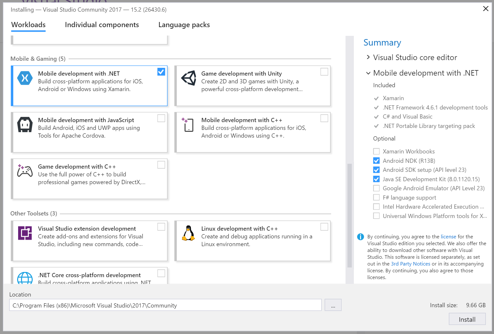
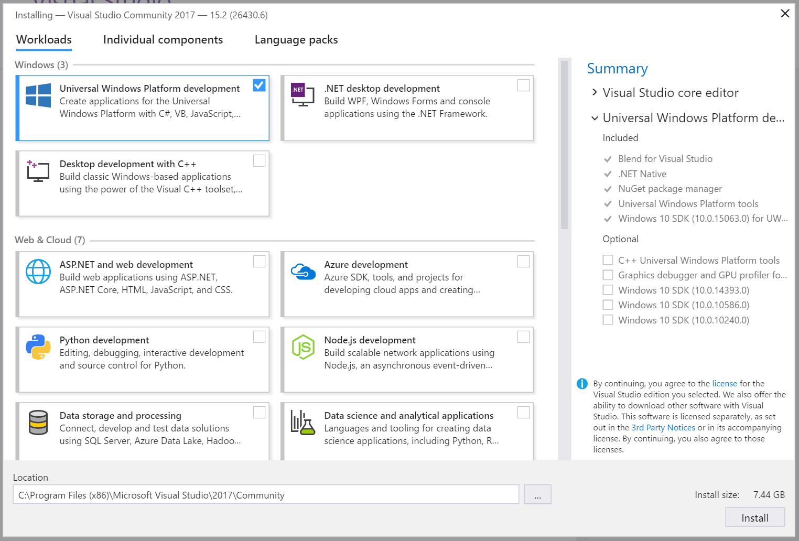
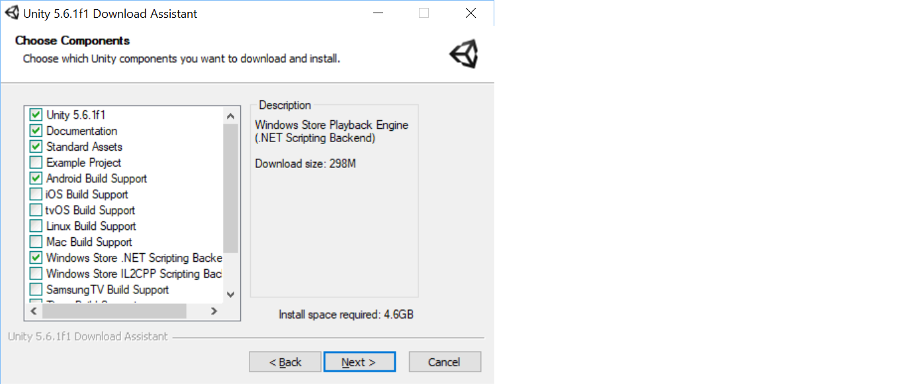

# Vorbereitung für den Hackathon
Im Rahmen des Hackathons werden wir Spiele entwickeln mit Unity, einer populären 2D/3D Game Engine, und Visual Studio Community, einer leistungsstarken IDE zum Code-Schreiben und Debuggen. Bitte installiere diese Tools schon im Voraus, damit wir während des Hackathons keine Zeit damit verschwenden.

Detaillierte Schritte für Windows und macOS:

## Windows
1. Download von [Visual Studio Community 2017](https://www.visualstudio.com/de/thank-you-downloading-visual-studio/?sku=Community&rel=15). Beim Setup je nach Smartphone-OS die folgenden Workloads auswählen:
    * **_Für Android-Phones:_ Mobile Development with .NET**: Von den optionalen Komponenten werden nur das Android NDK, Android SDK und das JDK benötigt  
    
    * **_Für Windows-Phones:_ Universal Windows Platform development**: Keine der optionalen Komponenten wird benötigt  
    

1. Download der [Unity Game Engine](https://store.unity.com/de/download?ref=personal). Beim Setup je nach Smartphone-OS die folgenden Komponenten wählen:
    * **Unity 5.6.1f1**
    * **Documentation**
    * **Standard Assets**
    * **Microsoft Visual Studio Tools for Unity**
    * **_Für Android-Phones:_ Android Build Support**
    * **_Für Windows-Phones:_ Windows Store .NET Scripting Backend**
    * Beispiel:  

## macOS
1. Download und Installation von [Visual Studio for Mac](https://www.visualstudio.com/de/vs/visual-studio-mac/)
1. Download und Installation der [Unity Game Engine](https://store.unity.com/de/download?ref=personal)