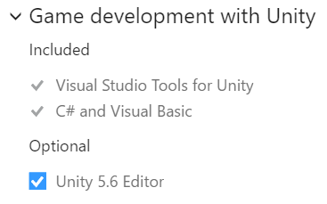
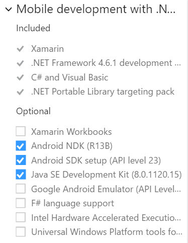
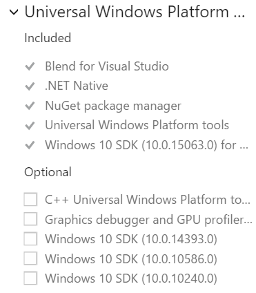
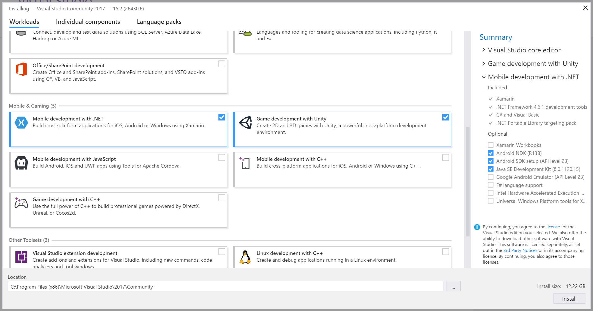

# Vorbereitung für den Hackathon
Im Rahmen des Hackathons werden wir Spiele entwickeln mit Unity, einer populären 2D/3D Game Engine, und Visual Studio Community, einer leistungsstarken IDE zum Code-Schreiben und Debuggen. Bitte installiere diese Tools schon im Voraus, damit wir während des Hackathons keine Zeit damit verschwenden.

Detaillierte Schritte für Windows und macOS:

## Windows
1. Download von [Visual Studio Community 2017](https://www.visualstudio.com/de/thank-you-downloading-visual-studio/?sku=Community&rel=15)
1. Beim Setup die folgenden Workloads auswählen:
    * **Game development with Unity**: Dies installiert nicht nur ein Unity-Plugin für Visual Studio, sondern auch die gesamte Unity Engine (dazu sicherstellen, dass unter _Summary_ "Unity 5.6 Editor" ausgewählt ist)
    
    * **_Für Android-Phones:_ Mobile Development with .NET**: Von den optionalen Komponenten werden nur das Android NDK, Android SDK und das JDK benötigt
    
    * **_Für Windows-Phones:_ Universal Windows Platform development**: Keine der optionalen Komponenten werden benötigt
    

## macOS
1. Download und Installation von [Visual Studio for Mac](https://www.visualstudio.com/de/vs/visual-studio-mac/)
1. Download und Installation der [Unity Game Engine](https://store.unity.com/de/download?ref=personal)

...weitere Schritte sind in Arbeit, bitte später nochmal vorbeischauen :)